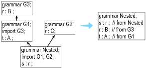

## 1. 语法结构

一份语法由一个语法声明和紧随其后的若干规则构成：
```
/** 可选的 javadoc 风格注释 */
grammar Name; ①
options {...}
import ... ;

tokens {...}
channels {...} // lexer only
@actionName {...}

rule1 // parser and lexer rules, possibly intermingled
...
ruleN
```
需要注意的是语法名称为 `X` 的文件名必须称为 `X.g4`。你可以按任何顺序排列选项 `options`、导入 `import`、词条 `tokens` 以及动作 `actions`。选项 `options`、导入 `import` 以及词条 `token` 是可有可无的，但是每一个最多只能出现一次。语法名称 ① 必须存在，同时必须至少有一个规则 `rule`，其他元素都是可选的。

规则 `rule` 的基本形式如下所示：
```
ruleName : alternative1 | ... | alternativeN ;
```
其中语法解析器规则名称必须以小写字母开头，词法分析器规则必须以大写字母开头。如果语法声明上没有添加 `lexer` 或者 `parser` 前缀，那么语法声明是一个混合语法，既可以包含词法分析器规则，也可以包含语法解析器规则。如果只要一份包含语法解析器规则的语法，使用如下的语法声明：
```
parser grammar Name;
...
```
如果只要一份包含词法分析器规则的语法，使用如下的语法声明：
```
lexer grammar Name;
...
```
只有词法分析器规则语法才可以包含 `mode` 声明，同时也只有词法分析器规则语法才可以包含自定义 `channels` 声明：
```
channels {
  WHITESPACE_CHANNEL,
  COMMENTS_CHANNEL
}
```

## 2. 语法导入

语法导入可以将语法分解为逻辑语法块和可复用语法块。导入的语法类似于面向对象编程语言中的父类。可以从导入语法中继承所有导入语法中的规则 `rule`、词条 `token` 声明以及具名动作 `action`。'主语法'中的规则会覆盖导入语法中的规则以实现继承。

> 继承导入语法的语法为主语法

可以将 `import` 理解为像是一个更智能的 `include` 语句（不会导入主语法中已经定义的规则）。导入的结果是生成了一个单一的混合语法；ANTLR 代码生成器看到的是一个完整的语法，并不感知语法的导入。

在处理主语法的过程中，ANTLR 工具将所有导入的语法加载到从属语法对象中。然后将导入语法中的规则 `rule`、词条 `token` 声明以及具名动作 `action`合并到主语法中。在下图中，右边的语法解析器规则语法说明了 ELang 语法导入 MyELang 语法中的效果：


MyELang 继承了导入语法 ELang 中的 stat、WS 和 ID 规则，但没有导入 expr 规则，此外本身自己添加了 INT 规则。下面的构建和测试运行示例，展示了 MyELang 可以识别整数表达式，但是导入语法 ELang 不能识别。第三行的错误输入语句触发了一条错误消息（提示期望的是 INT 或者 ID），从而说明语法解析器使用的是 MyELang 的 expr 而不是 ELang 的：
```
$ antlr4 MyELang.g4
$ javac MyELang*.java
$ grun MyELang stat
=>  34;
=>  a;
=>  ;
=>  EOF
<=  line 3:0 extraneous input ';' expecting {INT, ID}
```
如果主语法或任何导入语法中存在 `mode` 模式，那么导入过程将导入这些 `mode` 模式并在不覆盖它们的情况下合并其规则。如果有 `mode` 模式变为空，因为其所有规则都已被该 `mode` 模式之外的规则覆盖，则该 `mode` 模式将被丢弃。

如果声明了词条 `token`，那么主语法会将其合并到 `token` 集合中。如果声明了 `Channel`，那么主语法会将其合并到 `Channel` 集合中。任意具名那个动作 `actions`，例如 `@members` 同样也会被合并。一般来说，我们应该尽量避免在导入语法中的规则中使用具名动作 `actions`，因为这会限制它们的复用性。ANTLR 还会忽略导入语法中的 `options` 选项。

导入的语法也可以导入其他语法。ANTLR 以深度优先的方式查找所有导入的语法。如果有两个或多个导入语法定义了规则 `r`，那么 ANTLR 会优先选择它找到的第一个 `r`。如下图所示，ANTLR 按照嵌套、G1、G3、G2 的顺序检查语法：



Nested 语法最终使用了来自 G3 的 `r` 规则，因为它在看到 G2 的 `r` 负责之前看到了 G3 的 `r` 规则。

需要注意的是并不是每一种语法都能导入其他语法：
- 词法分析器语法可以导入词法分析器语法，包括包含 `mode` 模式的词法分析器语法。
- 语法解析器语法可以导入语法解析器语法。
- 混合语法可以导入没有 `mode` 模式的语法解析器或者词法分析器语法。

ANTLR 将导入的规则添加到主词法分析器语法中规则列表的末尾。这意味着主语法中的词法分析器规则优先于导入的规则。例如，如果一个主语法定义了规则 `if: 'if';`，同时导入的语法定义规则 `ID: [a-z]+;`(它也能识别 `if`)，那么导入的 ID 规则不会隐藏主语法的 `if` 词条定义。

## 3. 词条部分

词条 token 部分存在的意义是定义没有相关词法分析器规则的语法所需的词条类型。基本语法如下所是：
```
tokens { Token1, ..., TokenN }
```
大多数时候，词条 `token` 部分主要用于定义语法中动作 `actions` 所需的 `token` 类型：
```
// 显式定义关键字 token 类型以避免隐式定义引发的告警
tokens { BEGIN, END, IF, THEN, WHILE }

@lexer::members { // keywords map used in lexer to assign token types
Map<String,Integer> keywords = new HashMap<String,Integer>() {{
 put("begin", KeywordsParser.BEGIN);
 put("end", KeywordsParser.END);
 ...
}};
}
```
词条 `token` 部分实际上只是定义了一组要添加到整个集合中的一组词条 `token`：
```
$ cat Tok.g4
grammar Tok;
tokens { A, B, C }
a : X ;
$ antlr4 Tok.g4
warning(125): Tok.g4:3:4: implicit definition of token X in parser
$ cat Tok.tokens
A=1
B=2
C=3
X=4
```

## 4. 语法级别的动作

目前只有两个在语法规则之外使用的具名动作 `actions` (对于 Java 目标语言)：`header` 和 `members`。`header` 将代码注入到生成的识别器类文件中，并在识别器类定义之前，`members` 将代码注入到识别器类定义中作为字段和方法。

对于混合语法，ANTLR 会将动作 `action` 注入语法解析器和词法分析器中。如果只是将动作限制在语法解析器，需要使用 `@parser::name`；如果将动作限制在词法分析器中，则需要使用 `@lexer::name`。如下所示语法为生成的代码指定了一个包名：
```
grammar Count;

@header {
package foo;
}

@members {
int count = 0;
}

list
@after {System.out.println(count+" ints");}
: INT {count++;} (',' INT {count++;} )*
;

INT : [0-9]+ ;
WS : [ \r\t\n]+ -> skip ;
```

语法本身应该放在 foo 目录下，例如 `xxx/foo/Count.g4`，以便 ANTLR 在相同的 foo 目录中生成代码(也可以使用 ANTLR 工具的 -o 选项):
```
$ cd foo
$ antlr4 Count.g4 # generates code in the current directory (foo)
$ ls
Count.g4		CountLexer.java	CountParser.java
Count.tokens	CountLexer.tokens
CountBaseListener.java CountListener.java
$ javac *.java
$ cd ..
$ grun foo.Count list
=> 	9, 10, 11
=> 	EOF
<= 	3 ints
```
Java 编译器会在 foo 目录下寻找 foo 包下的类。

> 原文：[Grammar Structure](https://github.com/antlr/antlr4/blob/master/doc/grammars.md)
