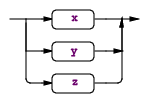
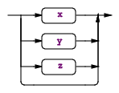
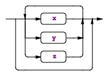
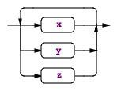

语法解析器由位于语法解析器规则语法或者混合语法中的一组解析器规则组成。Java 应用程序通过调用由 ANTLR 自动生成的、与所需启动规则相对应的规则函数来启动语法解析器。规则最基本的形式包含规则名称，以及后面跟一个以分号结尾的备选分支名称：
```
/** Javadoc 注释可以放在规则之前 */
retstat : 'return' expr ';' ;
```

## 1. 备选分支

规则中除了包含规则名称之外，还可以包含以 `|` 分隔的备选分支：
```
operator:
 	stat: retstat
 	| 'break' ';'
 	| 'continue' ';'
 	;
```
备选分支是一组规则元素的列表，也可以为空。如果规则中有一个空的备选分支，那么规则就可以成为一条可选规则，如下所示：
```
superClass
 	: 'extends' ID
 	| // 空的备选分支意味着其他的备选分支是可选的
 	;
```

## 2. 备选分支标签

为了获得更加精确的语法解析器监听事件，可以通过使用 `#` 符号来给规则的最外层备选分支添加标签。如果备选分支上没有标签，ANTLR 只为规则生成一个方法；如果有标签就可以为每个备选分支添加不同的监听方法，从而对每种输入都获得一个不同的事件。一条规则中的备选分支要么全带上标签，要么全部不带标签：
```
grammar A;
stat: 'return' e ';' # Return
 	| 'break' ';' # Break
 	;

e   : e '*' e # Mult
    | e '+' e # Add
    | INT # Int
    ;
```
ANTLR 会为每个标签生成一个规则上下文类。下面是 ANTLR 为上面语法 `A` 生成的监听器：
```java
public interface AListener extends ParseTreeListener {
 	void enterReturn(AParser.ReturnContext ctx);
 	void exitReturn(AParser.ReturnContext ctx);
 	void enterBreak(AParser.BreakContext ctx);
 	void exitBreak(AParser.BreakContext ctx);
 	void enterMult(AParser.MultContext ctx);
 	void exitMult(AParser.MultContext ctx);
 	void enterAdd(AParser.AddContext ctx);
 	void exitAdd(AParser.AddContext ctx);
 	void enterInt(AParser.IntContext ctx);
 	void exitInt(AParser.IntContext ctx);
}
```
从上面可以看到同时也会为每个带标签的备选分支生成一个进入方法和一个退出方法，例如 Return 标签的 `enterReturn` 和 `exitReturn`。这些方法的参数类型取决于备选分支本身，即备选分支标签的规则上下文类，例如 AParser.ReturnContext。

下面是 ANTLR 为上面语法 `A` 生成的访问器：
```java
public interface AVisitor<T> extends ParseTreeVisitor<T> {
	T visitReturn(AParser.ReturnContext ctx);
	T visitBreak(AParser.BreakContext ctx);
	T visitInt(AParser.IntContext ctx);
	T visitBinaryOp(AParser.BinaryOpContext ctx);
}
```
ANTLR 也会为每个标签生成一个规则上下文类，也会为每个带标签的备选分支生成一个 visit 开头的访问。

可以在多个备选分支上使用相同的标签，从而指示解析树遍历器为这些备选分支触发相同的事件。例如，下面是上面语法 `A` 中规则 `e` 的变体，复用了 BinaryOp 标签：
```
e : e '*' e # BinaryOp
 	| e '+' e # BinaryOp
 	| INT # Int
 	;
```
ANTLR 会为 `e` 生成如下监听器方法：
> 监听器方法
```java
void enterBinaryOp(AParser.BinaryOpContext ctx);
void exitBinaryOp(AParser.BinaryOpContext ctx);
void enterInt(AParser.IntContext ctx);
void exitInt(AParser.IntContext ctx);
```

如果备选分支标签名称与规则名称冲突，ANTLR 会报错 `rule alt label xxx conflicts with rule xxx`。下面是规则 `e` 的另一个重写，其中两个备选分支标签名称与规则名称冲突：
```
e : e '*' e # e
| e '+' e # Stat
| INT # Int
;
```
规则上下文类是通过规则名称或者备选分支标签名称生成的，因此标签 Stat 与规则 Stat 发生冲突：
```
$ antlr4 A.g4
 	error(124): A.g4:5:23: rule alt label e conflicts with rule e
 	error(124): A.g4:6:23: rule alt label Stat conflicts with rule stat
 	warning(125): A.g4:2:13: implicit definition of token INT in parser
```

## 3. 规则上下文对象

ANTLR 为每个规则引用生成规则上下文对象。对于只包含一个规则引用的规则，ANTLR 生成一个无参方法。如下规则所示，只有一个规则引用：
```
inc : e '++' ;
```
对于上述规则，ANTLR 会自动生成 `IncContext` 上下文类对象，并且包含一个无参方法 `e`：
```java
public static class IncContext extends ParserRuleContext {
 	public EContext e() { ... } // 返回与 e 关联的上下文对象
 	...
}
```
当一个规则有多个引用时，如下所示：
```
field : e '.' e ;
```
对于上述规则，ANTLR 会自动生成一个带索引值的方法来访问第 i 个规则元素（参数是访问第 i 个规则元素的索引值），另外还生成一个方法返回该规则所有的上下文对象：
```java
public static class FieldContext extends ParserRuleContext {
 	public EContext e(int i) { ... } // 返回第 i 个规则元素的上下文对象
 	public List<EContext> e() { ... } // 返回规则所有的上下文对象
 	...
}
```
如果我们有一个规则 `s` 引用了 `field` 规则，可以通过一个内嵌动作 `action` 来访问由 `field` 规则所有上下文对象列表（调用 `e` 方法）:
```
s : field
 	{
 	List<EContext> x = $field.ctx.e();
 	...
 	}
;
```
监听器或者访问器都可以做同样的事情。给定一个指向 FieldContext 对象的指针 `f`, `f.e()` 将返回规则所有上下文对象列表。

## 4. 规则元素

规则元素，顾名思义，一条规则的组成元素。规则元素可以是一条规则 `rule`、一个词条 `token` 或者一个字符串文字常量，例如表达式、ID 或者字符串 'return'。规则元素指定了解析器在给定时刻应该做什么，就像编程语言中的语句一样。下面是规则元素的完整列表：

| 用法  | 说明 |
| :------------- | :------------- |
| `T` | 在当前输入位置匹配词条 `T`。词条总是以大写字母开头。 |
| `'literal'` | 在当前输入位置匹配字符串文本常量。字符串文本常量就是一个由固定字符串组成的词条。|
| `r` | 在当前输入位置匹配规则 `r`，这相当于像调用函数一样调用规则。语法解析器规则名称总是以小写字母开头。|
| `r [«args»]` | 在当前输入位置匹配规则 `r`，像函数调用一样传入一组参数。方括号内的参数满足目标语言的语法，通常是逗号分隔的表达式列表。|
| `{«action»}` | 在前一个的备选分支元素之后，后一个备选分支元素之前立即执行一个动作 `action`。动作中的代码满足目标语言的语法。ANTLR 将动作中的代码逐字复制到生成的类中，除了替换属性和 `token` 引用，例如 `$x` 和 `$x.y`。|
| `{«p»}?` | 计算语义谓词 `«p»`。如果 `«p»` 在运行时计算为 false，则不会继续解析谓词之后的内容。一般用在预测期间，当 ANTLR 区分备选分支时，启用或禁用对应谓词的备选分支。|
| `.` | 匹配除文件结束符之外的任意词条 `token`。`.` 符号称为通配符。|

当你希望匹配除特定词条 `token` 或者词条集合之外的所有内容时，可以使用 `~` 非运算符。这个运算符在语法解析器规则中很少使用。`~INT` 表示匹配除 `INT` 词条以外的任何词条。`~','` 表示匹配除逗号以外的任何词条。`~(INT|ID)` 表示匹配除 `INT` 或 `ID` 之外的任何词条。

## 5. 规则元素标签

可以使用 `=` 符号为规则元素添加标签，以此将字段添加到规则上下文对象中：
```
expr:   expr op=('*'|'/') expr      # MulDiv
    |   expr op=('+'|'-') expr      # AddSub
    |   INT                         # int
    |   ID                          # id
    |   '(' expr ')'                # parens
    ;
```
如上面所述 op 是为子规则 `('*'|'/')` 和 `('+'|'-')` 添加的规则元素标签。规则元素标签会成为语法解析树节点类中的一个字段。在上面例子中，为 MulDiv 备选分支对应的上下文对象 MulDivContextt 添加一个 `op` 字段：
```java
public static class MulDivContext extends ExprContext {
	public Token op;
 	...
}
```
可以使用 `+=` 列表标签符方便的获取一组词条 `token`。如下所示，`array` 规则可以用来匹配一个简单的数组，通过 `el` 列表标签可以获取数组的所有元素：
```
array : '{' el+=INT (',' el+=INT)* '}' ;
```
对于上述规则，ANTLR 在 ArrayContext 上下文类中生成一个 List 字段：
```java
public static class ArrayContext extends ParserRuleContext {
 	public List<Token> el = new ArrayList<Token>();
 	...
}
```
`+=` 列表标签符也适用于规则引用：
```
elist : exprs+=e (',' exprs+=e)* ;
```
对于上述规则，ANTLR 在 ElistContext 上下文对象中生成一个 List 字段：
```java
public static class ElistContext extends ParserRuleContext {
 	public List<EContext> exprs = new ArrayList<EContext>();
 	...
 }
```

## 5. 子规则

规则中可以包含名为子规则的可选块。子规则与规则类似，只是缺少名称并用圆括号括起来的规则。子规则在括号内可以有一个或多个备选分支。子规则不能像规则那样使用 `local` 和 `return` 定义属性。目前一共存在四种子规则(x, y, z代表语法元素)：

### 5.1 (x|y|z)



格式：`(x|y|z)`，匹配子规则内的任意备选分支一次。具体例子如下：
```
returnType : (type | 'void') ;
```

### 5.2 (x|y|z)?



格式：`(x|y|z)?`，匹配子规则内的任意备选分支一次或者不匹配。具体例子如下：
```
classDeclaration
    : 'class' ID (typeParameters)? ('extends' type)?
      ('implements' typeList)?
 	   classBody
    ;
```

### 5.3 (x|y|z)*



格式：`(x|y|z)*`，匹配子规则内的任意备选分支零次或者多次。具体例子如下：
```
annotationName : ID ('.' ID)* ;
```

### 5.4 (x|y|z)+

</td>

格式：`(x|y|z)+`，匹配子规则内的任意备选分支一次或者多次。具体例子如下：
```
annotations : (annotation)+ ;
```

## 6. 捕获异常

当一条规则中发生语法错误时，ANTLR 会捕获异常，报告错误，并尝试恢复(可能通过使用更多词条)，然后从规则返回。每条规则都包含在 `try/catch/finally` 语句中:
```
void r() throws RecognitionException {
 	try {
 		rule-body
 	}
 	catch (RecognitionException re) {
	 	_errHandler.reportError(this, re);
	 	_errHandler.recover(this, re);
 	}
 	finally {
		exitRule();
 	}
}
```
可以使用策略对象来改变 ANTLR 的错误处理策略。然而，替换这个策略会影响到所有规则的策略。如果想要更改单个规则的异常处理策略，可以在规则定义后指定一个异常（这样只会影响这一条规则）:
```
r : ...
  ;
  catch[RecognitionException e] { throw e; }
```
该示例展示了如何避免使用默认的错误报告和恢复机制。当出现报错时，`r` 规则会重新抛出异常，这在对于希望更高层规则报告错误时非常有用。指定任何异常子句都会让 ANTLR 不再生成处理 RecognitionException 的子句。

你也可以指定其他异常:
```
r : ...
  ;
  catch[FailedPredicateException fpe] { ... }
  catch[RecognitionException e] { ... }
```
花括号内的代码段以及作为参数的异常必须使用目标语言编写，在这里是 Java。当你在即使发生异常时也要执行一个动作 `action`，要把它放在 `finally` 子句中：
```
r : ...
  ;
  // catch blocks go first
  finally { System.out.println("exit rule r"); }
```
finally 子句在规则触发 exitRule 之前执行。如果你希望在规则完成匹配备备选分支之后，但在完成清理工作之前执行动作，可以使用 `after`。

如下是一个完整的异常列表:

| Exception 名称  | 说明 |
| :------------- | :------------- |
| RecognitionException | 由 ANTLR 生成的识别器抛出的所有异常的父类，是 `RuntimeException` 的一个子类，不会带来受检异常的麻烦。该异常会记录识别器(词法分析器或语法解析器)在输入中的位置、在ATN(表示语法的内部图数据结构)中的位置、规则调用堆栈以及发生了什么类型的问题。|
| NoViableAltException | 表示解析器无法通过分析剩余的输入来决定采用两个或多个路径中的哪一个。该异常跟踪错误输入的起始词条，还知道错误发生时语法解析器在各个路径中的位置。|
| LexerNoViableAltException | 等同于 NoViableAltException，但仅用于词法分析器。|
| InputMismatchException | 当前输入词条 Token 与解析器所期望的不匹配。 |
| FailedPredicateException | 在预测期间语义谓词为 false 将导致周围的备选分支不可用。预测发生在规则预测选择哪个备选分支时。如果所有可行路径都不可用，解析器将抛出 NoViableAltException。如果是在匹配词条、调用规则的正常解析过程中，语义谓词在预测之外为 false 时，解析器抛出该异常。|


## 7. 规则属性定义

有许多与动作 `action` 相关的语法元素与规则相关联。规则可以像编程语言中的函数一样使用，可以有参数、返回值以及局部变量(规则可以在规则元素中嵌入动作)。ANTLR 收集定义的所有变量并将它们存储在规则上下文对象中。这些变量通常称为属性。属性可能定义的位置，以及具体使用用法如下所示：
```
rulename[args] returns [retvals] locals [localvars] : ... ;
```
定义在 `[…]` 中的属性可以像其他变量一样使用。下面是一个使用参数计算并作为返回值返回的示例规则:
```
// 将参数值与 INT 词条对应值相加并返回结果
add[int x] returns [int result] : '+=' INT {$result = $x + $INT.int;} ;
```
args, locals 和 return 的 `[…]` 通常都是目标语言，但有一些限制。`[…]` 字符串是一个逗号分隔的声明列表，其中包含前缀或后缀类型符号或无类型符合。元素可以进行初始化，如 `[int x = 32, float y]`。

在语法层面，你可以指定规则级别的具名动作。对于规则，有效的名称包含 `init` 和 `after`。顾名思义，解析器在尝试匹配相关规则之前立即执行 `init` 动作，并在匹配规则之后立即 `after` 动作。ANTLR 的 `after` 动作不会作为自动生成规则函数的 finally 代码块的一部分。可以使用 ANTLR 的 finally 动作来放置在规则函数 finally 代码块中执行的代码。这样的动作 `action` 出现在任意参数、返回值或者局部变量之后：
```
/** Derived from rule "row : field (',' field)* '\r'? '\n' ;" */
row[String[] columns]
   returns [Map<String,String> values]
   locals [int col=0]
	@init {
	$values = new HashMap<String,String>();
	}
	@after {
	if ($values!=null && $values.size()>0) {
	System.out.println("values = "+$values);
	}
	}
	: ...
	;
```
规则 `row` 接受参数 `columns`，返回 `values`，并定义了局部变量 `col`。方括号中的内容直接复制到自动生成的代码中：
```java
public class CSVParser extends Parser {
	...
	public static class RowContext extends ParserRuleContext {
		public String [] columns;
		public Map<String,String> values;
		public int col=0;
		...
	}
	...
}
```
生成的规则函数也将规则参数作为函数参数，并将参数复制到局部 RowContext 对象中:
```java
public class CSVParser extends Parser {
 	...
 	public final RowContext row(String [] columns) throws RecognitionException {
	 	RowContext _localctx = new RowContext(_ctx, 4, columns);
	 	enterRule(_localctx, RULE_row);
	 	...
 	}
 	...
}
```
ANTLR 能够分析嵌套在动作中的 `[…]`，这样便能正确解析 `String[]` 列。它还也能分析尖括号，以便泛型类型参数中的逗号不会被错误的解析成另一个属性的开始。例如，`Map<String,String>` 是一个属性定义。

一个动作中可以包含多个属性，甚至是作为返回值的动作。在同一个动作中使用逗号分隔属性：
```
a[Map<String,String> x, int y] : ... ;
```
ANTLR 会将这个动作解析为两个参数 x 和 y：
```java
public final AContext a(Map<String,String> x, int y) throws RecognitionException {
	AContext _localctx = new AContext(_ctx, 0, x, y);
	enterRule(_localctx, RULE_a);
	...
}
```

## 8. 起始规则和文件结束符

起始规则是语法解析器首先使用的规则；语言应用程序会调用它对应的规则函数。例如，一个被解析 Java 代码的语言应用程序可能会调用 `parser.compilationunit()` 方法，其中 parser 是一个 JavaParser 对象。语法中的任意规则都可以作为起始规则。

起始规则不一定使用所有的输入。它们只使用匹配规则备选分支所需的输入即可。例如，如下规则根据输入匹配一个、两个或者三个词条 `token`：
```
s : ID
  | ID '+'
  | ID '+' INT
  ;
```
如果输入是 `a+3`，规则 `s` 匹配第三个备选分支；如果是 `a+b`，匹配第二个备选分支，并忽略最后一个词条 `b`；如果是 `a b`，则匹配第一个备选分支，并忽略词条 `b`。对于后两种 Case，解析器不会使用完整的输入（即上面所说的只使用匹配规则备选分支所需的输入即可），因为规则 `s` 并没有明确的指出文件结束符必须出现在匹配规则的备选分支之后。

这种默认行为对于编写 ide 之类的东西非常有用。想象一下，IDE 想要解析一个大 Java 文件中间的某个方法。对规则 methodDeclaration 的调用应该只匹配一个方法，并忽略后面出现的任何文本。

另一方面，描述整个输入文件的规则应该引用特殊的预定义词条 `EOF`。如果没有，你可能百思不得其解，为什么不管你输入什么，起始规则都不会报错。下面是读取配置文件语法的一部分：
```
config : element*; // 能够 "匹配" 带有无效内容的输入文本
```
无效的输入会导致 `config` 立即返回，不匹配任何输入，也不报告错误。下面是正确的用法：
```
file : element* EOF; // 不会提前结束 必须匹配所有输入文本
```

> 原文:[Parser Rules](https://github.com/antlr/antlr4/blob/master/doc/parser-rules.md)
