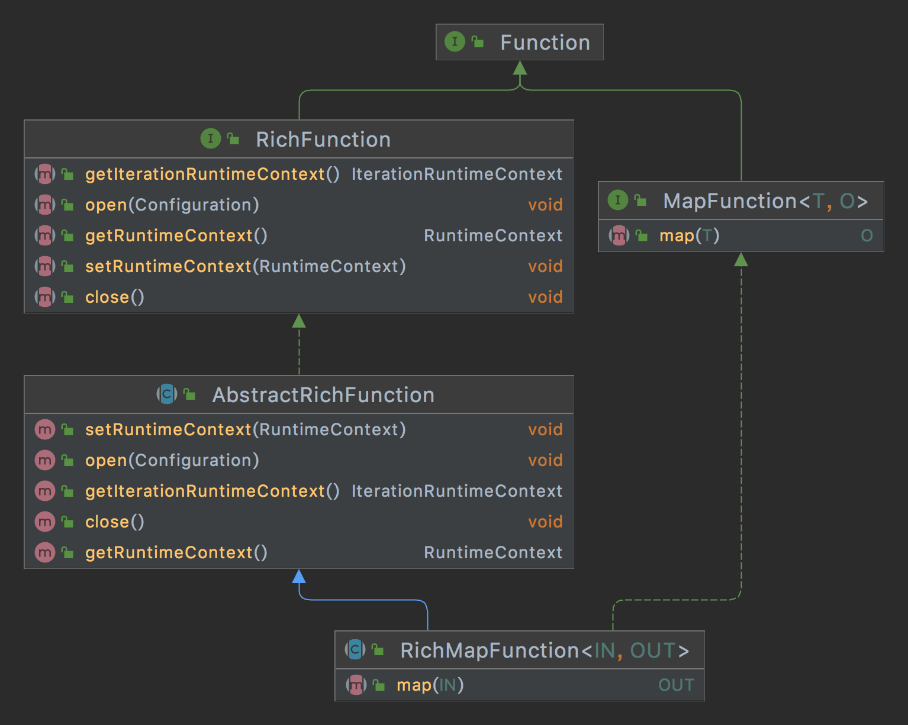

> Flink：1.13.5

## 1. 什么是富函数

很多时候，我们需要在函数处理第一条记录之前进行一些初始化的工作或者获得函数执行上下文的一些信息，以及在处理完记录后做一些清理工作。而 DataStream API 中的富函数 RichFunction 就提供了这样的机制。DataStream API 提供了一类富函数，和普通函数相比可对外提供跟多的功能。

DataStream API 中所有的转换函数都有对应的富函数，例如 MapFunction 和 RichMapFunction、SourceFunction 和 RichSourceFunction、SinkFunction 和 RichSinkFunction。可以看出，只需要在普通函数的前面加上 Rich 前缀就是富函数了。富函数可以像普通函数一样接收参数，并且富函数的使用位置也和普通函数相同，即在使用普通函数的地方都可以使用对应的富函数来代替。

## 2. 层次关系

我们以 RichMapFunction 为例具体看一下富函数的层次关系：



Function 接口是所有用户自定义函数的基本接口，RichFunction 和 MapFunction 都是继承在 Function 接口。可以看到，MapFunction 接口只提供了核心转换操作 `map`：
```java
public interface MapFunction<T, O> extends Function, Serializable {
    O map(T value) throws Exception;
}
```
而其他重要功能都是来自于 RichFunction：
```java
public interface RichFunction extends Function {
    void open(Configuration parameters) throws Exception;
    void close() throws Exception;
    // Runtime context
    RuntimeContext getRuntimeContext();
    IterationRuntimeContext getIterationRuntimeContext();
    void setRuntimeContext(RuntimeContext t);
}
```
RichFunction 是所有用户自定义富函数的基本接口。该类定义了用于函数生命周期的方法 `open` 和 `close`，以及用于访问执行函数的上下文的方法 `getRuntimeContext`、`getIterationRuntimeContext` 和 `setRuntimeContext`：
- `open()`
  - 是富函数的初始化方法。在每个任务首次调用转换方法(map 或者 filter 等)之前会被调用一次。通常用来做一些一次性的初始化工作。默认情况下，此方法不做任何事情。
- `close()`
  - 是富函数的终止方法。在每个任务最后一次调用转换方法(map 或者 filter 等)之后会被调用一次。通常用来做一些清理和释放资源的工作。
- `getRuntimeContext()`
  - 获取函数的运行时上下文 RuntimeContext。可以从 RuntimeContext 中的获取一些信息，例如函数的并行度，函数所在子任务的编号，当函数的子任务名字。此外还提供了对 `org.apache.flink.api.common.accumulators.Accumulators` 和 `org.apache.flink.api.common.cache.DistributedCache` 的访问。
- `getIterationRuntimeContext()`
  - 获取函数的 RuntimeContext 的专门版本迭代运行时上下文 IterationRuntimeContext。可以从 IterationRuntimeContext 中获取关于执行函数的迭代的额外信息。需要注意的是仅在函数是迭代的一部分时可用。否则，该方法抛出异常。
- `setRuntimeContext()`：用来设置函数的运行时上下文。

## 3. 如何使用

如下所示我们自定义了一个富函数 RichMapFunction 来计算每个单词的出现次数：
```java
// 自定义实现富函数 RichMapFunction
private static class WordCounterMapFunction extends RichMapFunction<String, Tuple2<String, Long>> {
    private ValueState<Long> counterState;

    @Override
    public void open(Configuration parameters) throws Exception {
        super.open(parameters);
        // 初始化计数器状态
        ValueStateDescriptor<Long> stateDescriptor = new ValueStateDescriptor<>("counter", Long.class);
        counterState = getRuntimeContext().getState(stateDescriptor);
    }

    @Override
    public Tuple2<String, Long> map(String word) throws Exception {
        // 当前执行子任务的编号
        int subtask = getRuntimeContext().getIndexOfThisSubtask();
        // 计数器计数
        Long count = counterState.value();
        if (Objects.equals(count, null)) {
            count = 0L;
        }
        Long newCount = count + 1;
        counterState.update(newCount);
        LOG.info("word: {}, count: {}, subtask: {}", word, newCount, subtask);
        return new Tuple2<>(word, newCount);
    }
}
```
通过上面代码可以看出我们在 `open()` 方法中做初始化的工作：初始化一个 ValueState 状态。此外，还在 map 转换中通过 `getRuntimeContext()` 方法来访问当前执行子任务的编号。

使用富函数比较简单，只需要在使用普通函数的地方替换为对应的富函数即可：
```java
// Socket 输入
DataStream<String> stream = env.socketTextStream("localhost", 9100, "\n");

// 单词流
DataStream<Tuple2<String, Long>> wordsStream = stream.flatMap(new FlatMapFunction<String, String>() {
    @Override
    public void flatMap(String value, Collector out) {
        for (String word : value.split("\\s")) {
            LOG.info("word: {}", word);
            out.collect(word);
        }
    }
}).keyBy(new KeySelector<String, String>() {
    @Override
    public String getKey(String word) throws Exception {
        return word;
    }
}).map(new WordCounterMapFunction()); // 使用富函数
// 输出
wordsStream.print();
```
假设我们输入 `a`、`b`、`a` 三个元素，可以看到如下的输出：
```
08:15:06,336 INFO   [] - word: a
08:15:06,436 INFO   [] - word: a, count: 1, subtask: 1
2> (a,1)
08:15:07,767 INFO   [] - word: b
08:15:07,868 INFO   [] - word: b, count: 1, subtask: 0
1> (b,1)
08:15:08,383 INFO   [] - word: a
08:15:08,388 INFO   [] - word: a, count: 2, subtask: 1
2> (a,2)
```

> 完整代码请查阅[RichFunctionExample](https://github.com/sjf0115/data-example/blob/master/flink-example/src/main/java/com/flink/example/stream/function/base/RichFunctionExample.java)
