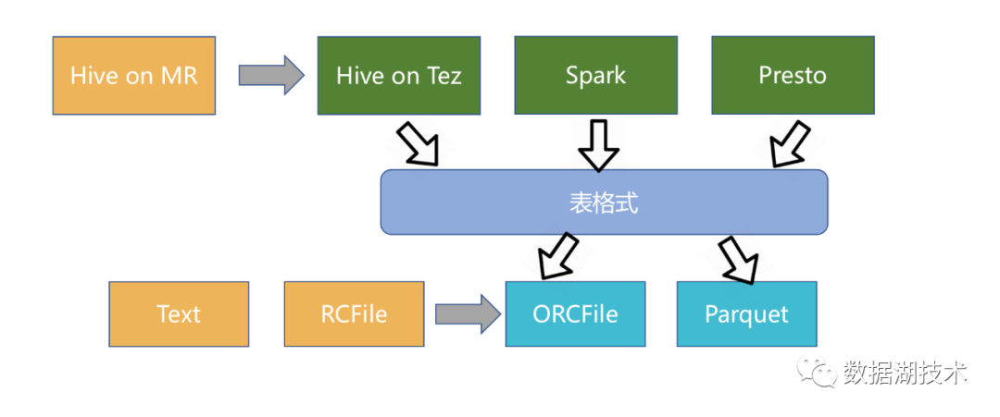
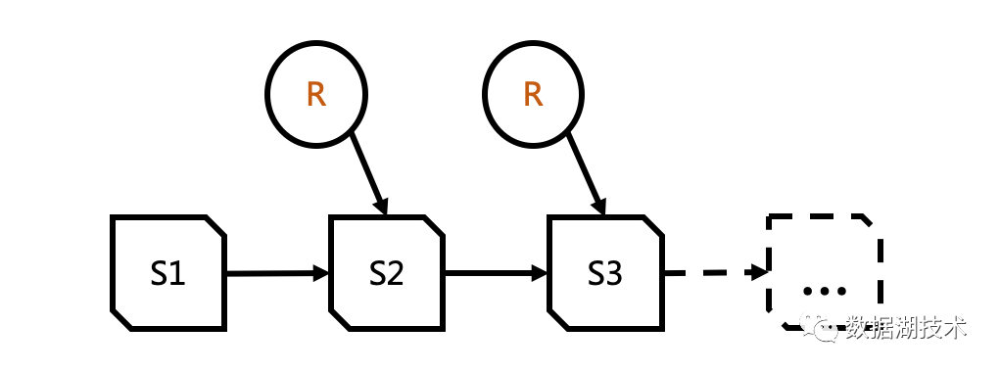

> 创作时间：2020-03-03

## 1. 导言

去年4月Databricks在Spark+AI summit上公布了Delta Lake项目，于此同时在Apache社区也有两个非常类似的项目Apache Iceberg和Apache Hudi在锐意开发中，这3个项目不管是在定位还是在功能方面都非常的类似，在大数据发展到现阶段为什么会涌现出这3个类似的项目呢，他们有什么差别呢？本文将从几个方面来介绍为什么我们需要这样一种技术，以及在这3个项目中为何我选择Apache Iceberg。

## 2. 如何定义这类新的技术

Delta Lake 将其定义为：Delta Lake is an open-source storage layer that brings ACID transactions to Apache Spark and big data workloads。而 Apache Iceberg 将其定义为：Apache Iceberg is an open table format for huge analytic datasets。

首先，这类技术它的定位是在计算引擎之下，又在存储之上。其次，它是一种数据存储格式，Delta Lake 称其为 "storage layer"，而 Iceberg 则称其为 "table format"。在我看来，这类技术是介于计算引擎和数据存储格式中间的数据组织格式。通过特定的方式将数据和元数据组织起来，因此称之为数据组织格式更为合理，而 Iceberg 将其定义为表格式也直观地反映出了它的定位和功能，下文将此类技术统称为"表格式”。



## 3. 为什么需要表格式

说完了什么是表格式，接下来我们将从两个方面来介绍为什么需要表格式。

### 3.1 数据的组织方式

从Hadoop诞生到现在，数据的存储格式经历了几代的发展，从最初的 txt file，到后来的 sequence file，rcfile，再到现在的 ORC，Parquet 等列式存储文件，数据的存储格式发生了翻天覆地的变化，更好的性能、更高的压缩比。然而数据组织方式的发展却相当缓慢。

Hive 提出了分区的概念 - 利用某几个列作为分区值来组织数据，能够有效地过滤掉无需读取的数据，这种分区在物理存储上反映出来的就是按照文件夹进行分区（组织）数据。利用文件夹来组织与 HDFS 的文件系统结构有天然的亲和性，因此这一方式也一直被沿用下来，但是这种数据的组织方式真的没有改进的空间了吗？

随着大数据和云计算的结合，越来越多的底层存储系统从 HDFS 这样的分布式文件系统换成了云上的对象存储系统，而这种利用文件夹来组织数据的方式在对象存储上遇到了极大的挑战：
- 利用对象存储来模拟文件系统从而提供文件夹遍历的方式非常低效，而传统的分区计算中又大量地依赖遍历操作。
- 基于文件、文件夹的 Rename 来保证原子性的语义在某些对象存储上是有问题的（如S3)。同时有的对象存储对于 Rename 的实现有巨大的开销。

那么是否能有一种新的数据组织方式对于对象存储等云存储有更好的亲和性呢？

### 3.2 元数据的存取方式

也是从 Hive 开始在大数据领域提出了 Metastore 的集中式服务来提供元数据管理的能力，集中式的元数据服务能够更好地管理整个数仓的元数据信息，但也带来了几个问题：
- 元数据和数据的分离式存储容易造成不一致性。比如在 HDFS 上对数据进行了某些删除、改动，但是 Metastore 并不能感知到数据的变化从而造成两边的不一致。
- 集中式的元数据管理对于大规模的企业级应用容易形成单点瓶颈。所以元数据都需要通过 Metastore 来存取，极易造成 Metastore 的压力，从而极大地延长 query plan 的时间。

为此，是否能够将数据和元数据有效地组织在一起来避免上面的问题呢？

## 4. 什么是Iceberg


Iceberg 官网这样介绍：Apache Iceberg is an open table format for huge analytic datasets. Iceberg adds tables to Presto and Spark that use a high-performance format that works just like a SQL table.

Iceberg 是一个通用的表格式（数据组织格式），它可以适配 Presto，Spark 等引擎提供高性能的读写和元数据管理功能。那 Iceberg 有什么优势呢？

## 5. Iceberg有什么优势

### 5.1 ACID

ACID 是现如今表格式的基本能力，Delta Lake、Hudi 和 Iceberg 都提供了 ACID 能力，由 ACID 能力所衍生出来的 Row Level Update/Delete 更是这些表格式最吸引人的特性。

Iceberg 提供了锁的机制来提供 ACID 的能力，在每次元数据更新时它会从 Hive Metastore 中获取锁并进行更新。同时 Iceberg 保证了线性一致性（Serializable isolation），确保表的修改操作是原子性的，读操作永远不会读到部分或是没有 commit 的数据。Iceberg 提供了乐观锁的机制降低锁的影响，并且使用冲突回退和重试机制来解决并发写所造成的冲突问题。

### 5.2 MVCC

基于 ACID 的能力，Iceberg 提供了类似于 MVCC 的读写分离能力：
- 首先，每次写操作都会产生一个新的快照（snapshot），快照始终是往后线性递增，确保了线性一致性。而读操作只会读取已经存在了的快照，对于正在生成的快照读操作是不可见的。
- 每一个快照拥有表在那一时刻所有的数据和元数据，因此提供了用户回溯（time travel）表数据的能力。利用 Iceberg 的 time travel 能力，用户可以读取那一时刻的数据，同时也提供了用户快照回滚和数据重放的能力。



### 5.3 解耦

相比于 Hudi，Delta Lake，Iceberg 提供了更为完整的表格式的能力、类型的定义和操作的抽象，并与上层数据处理引擎和底层数据存储格式的解耦。
- 对接上层，Iceberg 提供了丰富的表操作接口，使得它非常容易与上层数据处理引擎对接，现已支持的包括 Spark（Spark2和Spark3），Presto，Pig，社区正在做的是 Hive 和 Flink 的适配。其中 Iceberg 对于 Spark 的支持最好，它同时支持 Spark2 的 Data Source V2 API 和 Spark3  的 Data Source V2 API（包括multiple catalog支持），同时对于 Spark 的谓词下推能力有全面的支持。
- 对接下层，Iceberg 屏蔽了底层数据存储格式的差异，提供对于 Parquet，ORC 和 Avro 格式的支持。Iceberg 起到了中间桥梁的能力，将上层引擎的能力传导到下层的存储格式。

相比于 Hudi，Delta Lake，Iceberg 在设计之初并没有绑定某种特定的存储引擎，同时避免了与上层引擎之间的相互调用，使得 Iceberg 可以非常容易地扩展到对于不同引擎的支持。

### 5.4 Table Evolution

Iceberg 支持 in-place table evolution，用户可以像 SQL 那样修改表的 schema，或者修改分区方式。Iceberg 无需用户重写表数据或者是迁移到新表上。

#### 5.4.1 Schema Evolution

Iceberg 支持如下这些 schema 修改操作：
- Add - 在表中或是在嵌套结构中新增column。
- Drop - 在表中或是在嵌套结构中移除已有的column。
- Rename - 在表中或是在嵌套结构中修改column的名字。
- Update - 提升数据的类型，支持column，struct field，map key，map value和list中的元素。
- Reorder - 调整表中说是嵌套结构中的column顺序。

同时 Iceberg 确保 schema evolution 是独立且没有副作用的。

#### 5.4.2 Partition Evolution

Iceberg 可以在已有的表上更新分区信息，因为查询语句并不直接引用分区值。同时 Iceberg 提供了隐式分区能力，因此用户无须利用分区信息来刻意构造一些 query 使得查询能够加速。相反，Iceberg 可以根据用户的 query 来自动地进行 partition pruning，从而过滤掉不需要的数据。

另外，在 Iceberg 中 partition evolution 是一个元数据操作，因此并不需要进行文件的重写。

### 5.5 隐式分区

既然说到了 Iceberg 的隐式分区功能，接下来就让我们来看一下什么是隐式分区，以及隐式分区带来的好处有哪些。

#### 5.5.1 Partitioning in Hive

为了展示 Hive 和 Iceberg 在分区实现上的不同点，让我们首先来看一下这样一张表 logs 吧。

在 Hive 中，分区是显式的，并且对用户呈现为 column 的形式，因此 logs 表就会有一列称为 event_date。当我们向表插入数据时，我们必须提供 event_date 列，如下所示：
```sql
INSERT INTO logs PARTITION (event_date)
SELECT
  level, message, event_time,
  format_time(event_time, 'YYYY-MM-dd')
FROM unstructured_log_source
```
同样的，当我们读取 logs 表的时候，在 event_time 这个过滤条件之外我们也必须指定 event_date 这样一个过滤条件来进行 partition pruning：
```sql
SELECT level, count(1) as count
FROM logs
WHERE event_time BETWEEN '2018-12-01 10:00:00' AND '2018-12-01 12:00:00'
  AND event_date = '2018-12-01'
```
如果我们没有指定 event_date 这样一个过滤条件，那么 Hive 就会扫描全表来匹配 event_time 这个过滤条件。这是因为 Hive 并不知道 event_time 这一列和 event_date 是相关的。

这就是显式分区，这样的分区方式有什么问题呢？
- Hive无法验证分区值，必须交由引擎或是用户来保证生成正确的分区值。
- 用户需要了解表的分区结构，从而写出更为"smart"的query。
- Query与分区schema紧紧地绑定在一起，因此无法进行partition evolution。

#### 5.5.2 Iceberg Hidden Partitioning

与 Hive 不同的是，Iceberg 通过 column 的值来自动地计算分区值，而无需用户生成，Iceberg 负责将 event_time 转换成 event_date，并且跟踪两者的映射关系。

正因为 Iceberg 无须用户来维护“分区列”，因此它可以隐藏分区。每次写入和读取可以正确地生成分区值并有效地进行分区过滤，用户甚至无需知道有 event_date 这样一列的存在。

更重要的是，由于有了隐式分区这样的功能，query 不再依赖于表的物理组织方式，从而 Iceberg 表可以根据数据的大小及聚合程度动态地修改分区策略而无需重写表。

当然 Iceberg 还有许多其他的优势，比如对象存储友好的数据组织方式，在数据存储格式之上的统一的向量化读取(基于Arrow实现)，完备的算子下推等等关于表结构的核心能力，就不在这一一赘述了。

## 6. Iceberg的发展

说了那么多Iceberg的优势，那 Iceberg 后面的发展是什么呢，还有什么能力是缺失的吗？
- 构建在ACID能力上的行级 update/delete 语义。Hudi 提供了基于 copy on write 和 merge on read 的行级更新能力，而 Delta Lake 提供了 copy on write 的行级更新能力。但是现在在 Iceberg 社区仍然缺乏一个统一的语义来实现这个功能。其中 copy on write 相对简单，利用 Iceberg 现有的 API 可以构建出这样的能力，这在我们内部也实现了。但是基于 merge on read 的能力需要涉及到格式的定义等一些列工作，这也是现在社区推动中的工作。
- 更多上游引擎的适配。上文也提到 Iceberg 现在对于 Spark 的支持度比较完善，同时也支持 Presto，Pig。但是对于其他主流引擎如 Flink，Hive 的支持仍然缺失，这也限制了 Iceberg 作为一个通用表格式的推广使用，这一块能力需要亟待加强。
- 统一的索引层来加速数据的检索。Iceberg 现在有丰富的文件级别的 metrics 来进行更好的条件过滤，但是这依赖于底层存储格式所提供的能力，同时由于涉及到 snapshot->manifest->datafile 的多级查询，在效率上有一定的损耗，一层统一的索引层来加速数据的检索非常必要。

当然 Iceberg 还有许多的特性功能需要添加，尤其是围绕生态系统的建立和周边能力的打造上还需要更多的发展。

## 7. 总结

本文从表格式这样一种技术的出现、发展来介绍表格式其存在的价值和意义，同时也着重介绍了Iceberg这样一个表格式的技术它的优势以及未来的发展，我相信未来“表格式”这种技术定会在大数据领域被广泛采用，而 Iceberg 作为一种优秀的实践也必会被大量的采用。


原文:[为什么我选择Apache Iceberg](https://mp.weixin.qq.com/s/CZYxOXmrEMjS3qn1yuni4w)
