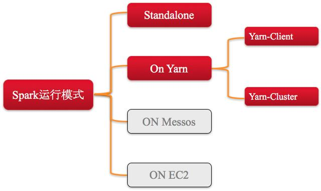
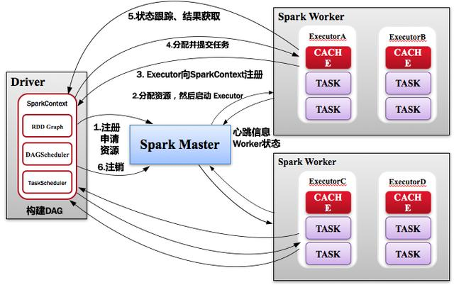
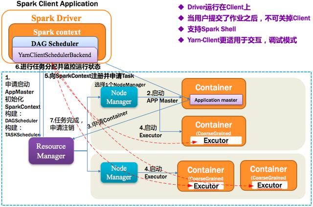
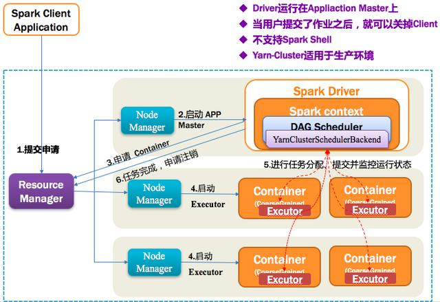
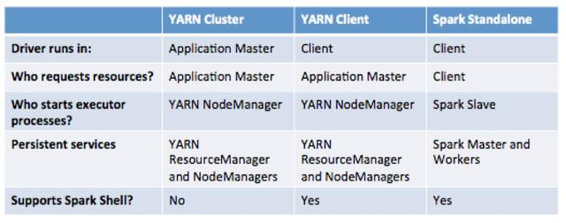

Spark 的运行模式又是什么样的呢？通过本文以下的讲解大家可以详细的学习了解。Spark 运行模式主要分为以下几种，如下图所示：

## 1. Local 本地模式

Local 本地模式就是一个独立的进程，通过内部的多个线程模拟整个集群，即启动一个 JVM 进程，通过进程中的多个线程执行任务 Task。一个 JVM 进程只能运行一个应用程序，如果运行多个需要启动多个 JVM 进程。可以通过 spark-shell 、pyspark、spark-submit 来启动 Local 本地模式。

## 2. Standalone 模式

Standalone 模式如下图所示：

- SparkContext连接到Master，向Master注册并申请资源（CPU Core and Memory）；
- uMaster根据SparkContext的资源申请要求和Worker心跳周期内报告的信息决定在哪个Worker上分配资源，然后在该Worker上获取资源，然后启动Executor； Executor向SparkContext注册；
- SparkContext将Applicaiton代码发送给Executor；同时SparkContext解析Applicaiton代码，构建DAG图，并提交给DAGScheduler分解成Stage，然后以Stage（或者称为TaskSet）提交给TaskScheduler，TaskScheduler负责将Task分配到相应的Worker，最后提交给Executor执行；
- Executor会建立Executor线程池，开始执行Task，并向SparkContext报告，直至Task完成；
- 所有Task完成后，SparkContext向Master注销，释放资源。如图所示。

## 3. Spark on Yarn-Client 模式

- Spark Yarn Client向Yarn的ResourceManager申请启动Application Master。同时在SparkContent初始化中将创建DAGScheduler和TASKScheduler；
- ResourceManager收到请求后，在集群中选择一个NodeManager，为该应用程序分配第一个Container，要求它在这个Container中启动应用程序的Application Master；
- Client中的SparkContext初始化完毕后，与ApplicationMaster建立通讯，向ResourceManager注册，根据任务信息向ResourceManager申请资源；
- 一旦ApplicationMaster申请到资源后，便与对应的NodeManager通信，要求它在获得的Container中启动Executor，启动后会向Client中的SparkContext注册并申请Task；
- Client中的SparkContext分配Task给Executor执行，Executor运行Task并向Driver汇报运行的状态和进度，以让Client随时掌握各个任务的运行状态，从而可以在任务失败时重新启动任务；
- 应用程序运行完成后，Client的SparkContext向ResourceManager申请注销并关闭自己。如图所示。

## 4. Spark on Yarn-Cluster 模式

- Spark Yarn Client向Yarn中提交应用程序，包括ApplicationMaster程序、启动ApplicationMaster的命令、需要在Executor中运行的程序等；
- ResourceManager收到请求后，在集群中选择一个NodeManager，为该应用程序分配第一个Container，要求它在这个Container中启动应用程序的ApplicationMaster，其中ApplicationMaster进行SparkContext等的初始化；
- ApplicationMaster向ResourceManager注册，这样用户可以直接通过ResourceManage查看应用程序的运行状态，然后它将采用轮询的方式通过RPC协议为各个任务申请资源，并监控它们的运行状态直到运行结束；
- 一旦ApplicationMaster申请到资源后，便与对应的NodeManager通信，要求它在获得的Container中启动启动Executor，启动后会向ApplicationMaster中的SparkContext注册并申请Task；
- ApplicationMaster中的SparkContext分配Task给Executor执行，Executor运行Task并向ApplicationMaster汇报运行的状态和进度，以让ApplicationMaster随时掌握各个任务的运行状态，从而可以在任务失败时重新启动任务；
- 应用程序运行完成后，ApplicationMaster向ResourceManager申请注销并关闭自己。如下图所示。

### 5. 几种模式对比（Yarn-Cluster VS Yarn-Client VS Standalone）

官网描述如下图所示，有兴趣的童鞋可以去Apache官网查询。

原文：https://www.toutiao.com/i6511989220175774222/
